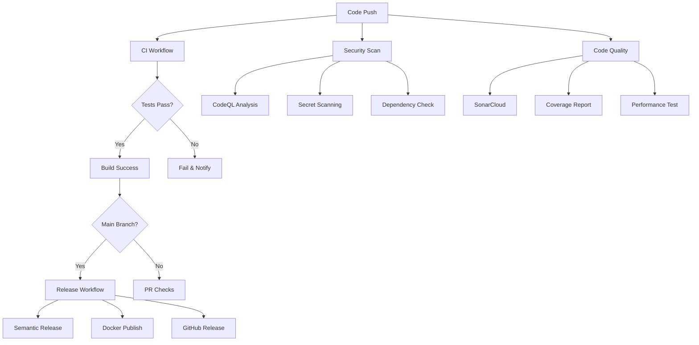

# GitHub Actions & Integrations Guide

This repository includes a comprehensive suite of GitHub Actions workflows and integrations to ensure code quality,
security, and automated processes.

## 🔄 Continuous Integration & Deployment

### Core Workflows

| Workflow        | Trigger                     | Purpose                                              |
| --------------- | --------------------------- | ---------------------------------------------------- |
| **CI**          | Push/PR to `main`/`develop` | Runs tests, linting, and type checking               |
| **Docker**      | Push/PR with Docker changes | Builds and tests Docker images                       |
| **Security**    | Push/PR + Weekly            | CodeQL analysis, secret scanning, Trivy, Snyk        |
| **Performance** | Push to `main` + Weekly     | Load testing, memory leak detection, bundle analysis |

### Code Quality

| Workflow          | Features                                                                 |
| ----------------- | ------------------------------------------------------------------------ |
| **Code Quality**  | SonarCloud analysis, Codecov coverage, complexity reports, Lighthouse CI |
| **Documentation** | API docs generation, markdown linting, link checking, changelog updates  |

### Release & Deployment

| Workflow     | Purpose                                                            |
| ------------ | ------------------------------------------------------------------ |
| **Release**  | Semantic releases, Docker image publishing, GitHub releases        |
| **Database** | Prisma schema validation, migration testing, schema diff detection |

### Project Management

| Workflow             | Features                                                                  |
| -------------------- | ------------------------------------------------------------------------- |
| **Issue Management** | Auto-labeling, reviewer assignment, stale issue cleanup, welcome messages |
| **Environment**      | Environment validation, deployment notifications, health checks           |

## 🔧 Required Secrets & Tokens

To enable all features, add these secrets to your repository settings:

### Optional Integrations (Add as needed)

```bash
SONAR_TOKEN          # SonarCloud integration
CODECOV_TOKEN        # Codecov integration
SNYK_TOKEN          # Snyk security scanning
SLACK_WEBHOOK_URL   # Slack notifications
NPM_TOKEN           # npm publishing (if needed)
LHCI_GITHUB_APP_TOKEN # Lighthouse CI
```

### Automatic (GitHub provides)

```bash
GITHUB_TOKEN        # Automatically provided by GitHub
```

## 🛠️ Recommended External Integrations

### 1. **Code Quality & Security**

#### SonarCloud

- **Purpose**: Code quality analysis, technical debt tracking
- **Setup**:
  1. Go to [sonarcloud.io](https://sonarcloud.io)
  2. Import your repository
  3. Add `SONAR_TOKEN` to repository secrets
- **Benefits**: Code smells, bugs, vulnerabilities, test coverage

#### Codecov

- **Purpose**: Code coverage tracking and reporting
- **Setup**:
  1. Go to [codecov.io](https://codecov.io)
  2. Install GitHub app
  3. No token needed for public repos
- **Benefits**: Coverage reports, PR coverage diff

#### Snyk

- **Purpose**: Security vulnerability scanning
- **Setup**:
  1. Sign up at [snyk.io](https://snyk.io)
  2. Generate API token
  3. Add `SNYK_TOKEN` to repository secrets
- **Benefits**: Real-time vulnerability alerts, automated fixes

### 2. **Performance & Monitoring**

#### Lighthouse CI

- **Purpose**: Performance, accessibility, SEO monitoring
- **Setup**:
  1. Install Lighthouse CI GitHub app
  2. Configure in `.lighthouserc.js`
- **Benefits**: Performance budgets, regression detection

#### Sentry (Recommended Addition)

- **Purpose**: Error tracking and performance monitoring
- **Setup**: Add `@sentry/node` to your NestJS app
- **Benefits**: Real-time error tracking, performance insights

### 3. **Communication & Notifications**

#### Slack Integration

- **Purpose**: Deployment and CI notifications
- **Setup**:
  1. Create Slack webhook
  2. Add `SLACK_WEBHOOK_URL` to secrets
- **Benefits**: Team notifications, deployment alerts

#### Microsoft Teams (Alternative)

- **Purpose**: Team notifications
- **Action**: `skitionek/notify-microsoft-teams@master`

### 4. **Project Management**

#### GitHub Projects (Built-in)

- **Purpose**: Issue and PR tracking
- **Setup**: Enable in repository settings
- **Benefits**: Automated project board updates

#### Linear Integration

- **Purpose**: Issue tracking with GitHub sync
- **Action**: `linear/github-sync-action@main`

## 📊 Workflow Visualization



## 🎯 Customization Guide

### Adding New Workflows

1. Create `.github/workflows/your-workflow.yml`
2. Follow existing patterns for consistency
3. Add documentation to this README

### Modifying Existing Workflows

1. Edit workflow files in `.github/workflows/`
2. Test changes in a feature branch
3. Update documentation as needed

### Environment-Specific Configuration

```yaml
# Example: staging-specific workflow
on:
  push:
    branches: [staging]

env:
  ENVIRONMENT: staging
  DATABASE_URL: ${{ secrets.STAGING_DATABASE_URL }}
```

## 🔍 Monitoring & Troubleshooting

### Workflow Status

Monitor workflow status in:

- **Actions tab** in GitHub repository
- **Pull Request checks**
- **Commit status indicators**

### Common Issues

1. **Secret not found**: Ensure secrets are properly configured
2. **Permission denied**: Check workflow permissions in repository settings
3. **Workflow not triggering**: Verify trigger conditions and file paths

### Debug Mode

Enable debug logging by adding these secrets:

```bash
ACTIONS_STEP_DEBUG=true
ACTIONS_RUNNER_DEBUG=true
```

## 📈 Metrics & Analytics

### Available Metrics

- **CI/CD Performance**: Build times, success rates
- **Code Quality**: Coverage trends, technical debt
- **Security**: Vulnerability count, resolution time
- **Performance**: Load test results, bundle size trends

### Viewing Reports

- **Actions**: GitHub Actions tab
- **Security**: Security tab (CodeQL, Dependabot)
- **Insights**: Repository insights for contribution metrics

## 🚀 Advanced Features

### Matrix Builds

Test across multiple environments:

```yaml
strategy:
  matrix:
    node-version: [18, 20, 22]
    os: [ubuntu-latest, windows-latest, macos-latest]
```

### Conditional Workflows

Run workflows based on conditions:

```yaml
if: github.actor != 'dependabot[bot]'
```

### Workflow Dispatch

Manual workflow triggers:

```yaml
on:
  workflow_dispatch:
    inputs:
      environment:
        description: 'Environment to deploy to'
        required: true
        default: 'staging'
```

## 📚 Additional Resources

- [GitHub Actions Documentation](https://docs.github.com/en/actions)
- [Awesome Actions](https://github.com/sdras/awesome-actions)
- [Security Best Practices](https://docs.github.com/en/actions/security-guides)
- [Workflow Syntax](https://docs.github.com/en/actions/reference/workflow-syntax-for-github-actions)

---

For questions or improvements to these workflows, please open an issue or submit a pull request! 🎉
